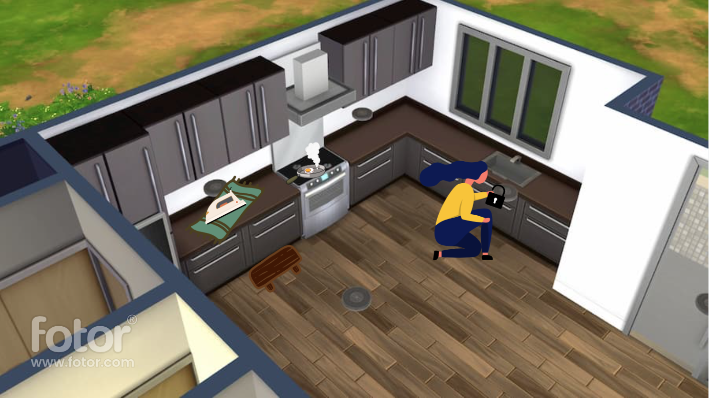

# Welcome to Hazard!

**Move Everything, find the keys, stop the fire!**

## Concept
--- 
Hazard is a puzzle game that meant to teach children how to handle hazardous objects without causing a fire, all while solving puzzles and keeping things playful and funny.

## Formal Elements
---
Feel free to browse the [Formal Elements](./formal_elements.md) section of the project.

## How to play
 ---
The game is currently unavailable, but once developed, instructions would be displayed here.